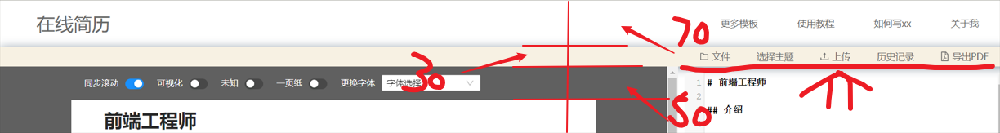

## 简历制作

使用 create-react-app 来搭建页面后面在考虑使用我自己的脚手架。页面可以分为三个部分

`HeaderCommander` : 负责页面路由

` navDownload `  ：负责导航栏 ( 导出PDF 历史记录 上传 选择主题 文件) 这几个功能

`Main`：主要页面 负责显示左展示页面 右编辑页面
  `LeftView`: 展示页面
      `leftViewButton`: 展示页面的摁钮组件（同步 可视化 未知 一页纸 更换字体 ）这几个功能
          `SynScroll`: 同步组件 （这里的导出名有问题）
          `ViewCodeMore`: 可视化功能组件 
          ---这里出现的问题是 （未知 一页纸 更换字体）这几个功能没有抽离出来
      然后在这里就开始将 md --> html 文件展示出来 感觉需要抽离出来做一个单独的页面后面好添加更多的模板样式
  `RightWrith`：编辑页面 在这里就直接使用了code来编辑

可视化组件：
先找到目标 可视化 区域位置然后开始开始绑定事件 `mouseover` 和 `mouseleave` 分别对这两种事件进行处理，获得目标 dom 的 `clientWidth\height` 和 `offsetLeft\right` 然后将 前者设置为盒子的宽度和高度 将后者设置为盒子 `screenY\X` 值就能获得一个动态的显示效果

同步滚动：
获得在右侧的页面滚动然后保存在 redux 中 之后再右侧盒子区域通过 ref 获得 dom 元素然后在设置为 右侧滚动左侧也滚动

`height: 左侧盒子的高度` 

`top: 左侧盒子距离顶部的距离`

转换公式：
> `leftBox.scrollTop = top * (leftBoxHeight + 150) / height `
> 为什么要 +150 因为我的视图距离顶部有 150px 的像素

两者高度的比值和距离顶部的值之积就是左侧盒子要的距离顶部的高度

`top1/leftHeight = top2/rightHeight` 

求解 `top1` = `top2*leftHeight/rightHeight`

## 评估

问题1、因为保存了大量的数据 每次页面的变化都会产生新的数据如果不做任何处理就保存在 redux 中是一种性能浪费（需要不停的创建变量来保存数据）

使用了 immutable.js 管理数据流 采用 Immutable 数据结构来存储数据 它的结构形式相当于多叉树的结构 当某个节点发生改变它能替换改变的节点并且复用原来的节点 （结构共享形成的持久化数据结构） 最大程度的复用数据，提高数据的更新速度，页面更新是由 传入组件的 props 和 本身状态 state 来操作的 当数据发生改动在没有使用 immutable 数据结构来管理数据时 判断一个对象是否发生改动是通过 对比前后 props 来判断 但是只是浅层对比 在对象层级过深就会失效 这时候就使用 `shouldComponentUpdate ` 函数来去判断节点是否更新 在这个过程中 通常使用 `浅比较` 来去比较是否发生改变 比如 React.PureComponent 它是以浅层对比 prop 和 state 的方式来实现了该函数。 （仅作对象的浅层比较） 通俗来讲是 PureComponent 以浅层比较的方式控制 shouldComponentUpdate 是否返回 true 来更新组件 PureComponent 是用在类组件的

~~~js
class App extend React.PureComponent {
  ....
}

extend default App
~~~

在函数组件中使用 `React.memo` 来包裹函数组件

~~~js
const App = () =>{
  ...
}

extend default React.memo(App)
~~~

这里引用官方的介绍
>React.memo 仅检查 props 变更。如果函数组件被 React.memo 包裹，且其实现中拥有 useState，useReducer 或 useContext 的 Hook，当 state 或 context 发生变化时，它仍会重新渲染。默认情况下其只会对复杂对象做浅层对比，如果你想要控制对比过程，那么请将自定义的比较函数通过第二个参数传入来实现。

如果想要对比复杂对象就要使用 深度的查找方式 但这样很浪费时间 而使用 immutable 后就不用了 每当数据发生改动就会返回一个新对象 且新对象在保存原有数据的同时又引用未改动的数据 大大提高了数据的更新速率 还能结合 React.memo() 来判断是否需要重新载入组件。

## 未来规划

**新功能：**

1、考虑使用 浏览器本地存储 保存用户每次的更改

2、添加更多项目模板

3、准备考虑使用 immutable.js 来去处理数据 让其可持久化 就算数据改变也会更改变动的地方 节省大量的性能损耗 非常需要这一功能（已添加）

4、
**修改**
1、在进一步的优化可视化功能

2、字体设置以及后面的间距设置要处理妥当

